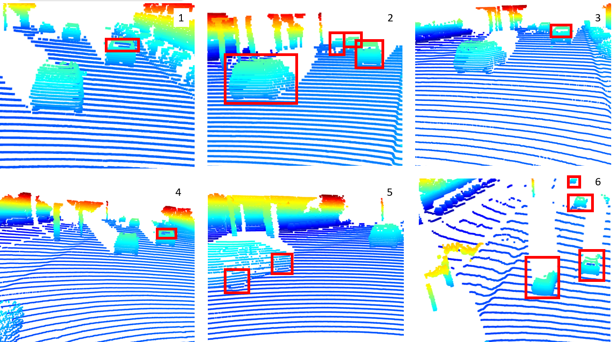
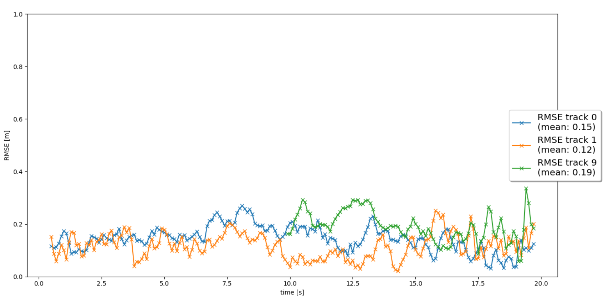
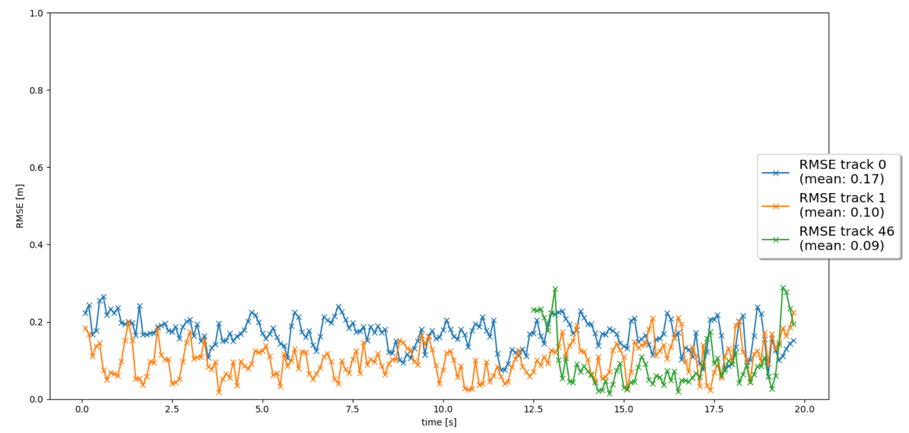

# 3D Lidar Data Inspection

In the images below we can see a 3d representation from the Lidar data from a sequence of the Waymo Open Dataset. 

## Vehicles with varying degrees of visibility
All 6 of these frames have been taken at different times. This can be seen well by the fact that there is a car overtaking the vehicle in the frames 3-6. This car is not visible in the front view of the car until it overtakes us and then it becomes visible in the front view.

Images 2 and 6 show the same 4 cars but at different points in time. In the picture 2 they are closer and therefore we can distinguish the individual features on the vehicles better than in the 6th picture where they are all further away.

## Vehicle features
In the frames 1, 3 and 4 I highlighted the rear windows of the car which can again be seen in all of these frames but from a different distance to that car.

In the frame 5 we can very nicely distinguish the wheels of the car next to us. These are however less stable over time than the rear features of the car as they are only visible during overtake manoeuvres.

# Final Project

    

## 1. Write a short recap of the four tracking steps and what you implemented there (filter, track management, association, camera fusion). Which results did you achieve? Which part of the project was most difficult for you to complete, and why?
The first part was about the Kalman Filter given Lidar measurements. For the measurement update I implemented the measurement model and for the prediction update I used a constant velocity model.

Then I implemented the track management which enabled me to track any car in any image by using the first sensor measurement as the initial guess. Then I also added the track score and state in order to be able to track the car over subsequent images.

The association step enabled the system to track multiple vehicles at the same time.

The camera fusion was the hardest step for me as I initially forgot to transform the predicted state to the camera sensor coordinates.

## 2. Do you see any benefits in camera-lidar fusion compared to lidar-only tracking (in theory and in your concrete results)? 

Looking at my results from  and   I can see that the RMSE has decreased substantially by adding the camera information to the KF.

## 3. Which challenges will a sensor fusion system face in real-life scenarios? Did you see any of these challenges in the project?
I could see many False Positives in terms of measurement from both the Lidar as well as the camera. I suspect that this could be worse in less ideal conditions like for example rainy nights

## 4. Can you think of ways to improve your tracking results in the future?
One could definitely think about tuning the process and measurement covariances to adapt them to the sensors.